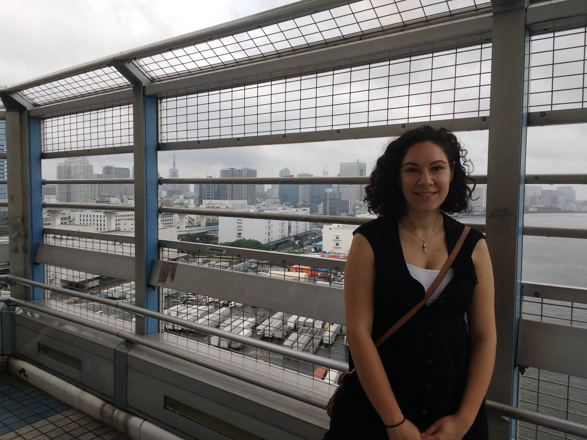

###MPH Candidate, Mailman School of Public Health

 

Hi! I'm Katie, a 2nd year Masters in Public Health student at Columbia University's Mailman School of Public Health. I'm currently studying epidemiology with a certifiacte in applied biostatistics. I received my B.S. from Cornell University in 2016. I'm also currently working at the New York City Department of Health and Mental Hygeine in foodborne disease surveillance.

You can learn more about me [here](./resume.pdf).
  

  